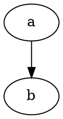

# simple_graphviz

General-purpose GraphViz library for Eiffel - generates diagrams using DOT language.

## Features

- **DOT Language Generation**: Build graphs programmatically and serialize to DOT format
- **Multiple Diagram Types**: BON class diagrams, flowcharts, state machines, dependency graphs, inheritance trees
- **GraphViz Rendering**: Render to SVG, PDF, PNG via GraphViz subprocess
- **Fluent API**: Builder pattern with method chaining
- **MML Contracts**: Mathematical Model Library postconditions with frame conditions
- **SCOOP Compatible**: Thread-safe design for concurrent applications

## Installation

Add to your ECF:

```xml
<library name="simple_graphviz" location="$SIMPLE_EIFFEL/simple_graphviz/simple_graphviz.ecf"/>
```

## Requirements

- EiffelStudio 25.02+
- simple_mml (MML for contracts)
- simple_process (subprocess execution)
- GraphViz (optional, for rendering - DOT generation works without it)

## Quick Start

### Basic Graph

```eiffel
local
    l_gv: SIMPLE_GRAPHVIZ
    l_graph: DOT_GRAPH
    l_node: DOT_NODE
do
    create l_gv.make
    l_graph := l_gv.graph
    l_node := l_graph.new_node ("a")
    l_node := l_graph.new_node ("b")
    l_graph.new_edge ("a", "b")
    print (l_graph.to_dot)
end
```

Output:


### BON Class Diagram

```eiffel
local
    l_gv: SIMPLE_GRAPHVIZ
    l_bon: BON_DIAGRAM_BUILDER
do
    create l_gv.make
    l_bon := l_gv.bon_diagram
    l_bon.add_class ("ANIMAL", True, False)  -- deferred
    l_bon.add_class ("DOG", False, False)
    l_bon.add_inheritance ("DOG", "ANIMAL")
    print (l_bon.to_dot)
end
```

### State Machine

```eiffel
local
    l_gv: SIMPLE_GRAPHVIZ
    l_sm: STATE_MACHINE_BUILDER
do
    create l_gv.make
    l_sm := l_gv.state_machine
    l_sm := l_sm.initial ("Idle")
        .state ("Running")
        .state ("Paused")
        .transition ("Idle", "Running", "start")
        .transition ("Running", "Paused", "pause")
        .transition ("Paused", "Running", "resume")
        .transition ("Running", "Idle", "stop")
    print (l_sm.to_dot)
end
```

### Flowchart

```eiffel
local
    l_gv: SIMPLE_GRAPHVIZ
    l_fc: FLOWCHART_BUILDER
do
    create l_gv.make
    l_fc := l_gv.flowchart
    l_fc := l_fc.start ("Begin")
        .process ("Process Data")
        .decision ("Valid?", "Yes", "No")
    print (l_fc.to_dot)
end
```

### Rendering to SVG

```eiffel
local
    l_gv: SIMPLE_GRAPHVIZ
    l_result: GRAPHVIZ_RESULT
do
    create l_gv.make
    if l_gv.is_graphviz_available then
        l_result := l_gv.render_svg ("digraph { a -> b }")
        if l_result.is_success then
            print (l_result.content)
        else
            print (l_result.error.message)
        end
    end
end
```

## API Reference

### SIMPLE_GRAPHVIZ (Facade)

| Feature | Description |
|---------|-------------|
| `make` | Create with default settings |
| `set_engine (name)` | Set layout engine (dot, neato, fdp, circo, twopi) |
| `set_timeout (ms)` | Set render timeout in milliseconds |
| `bon_diagram` | Get BON diagram builder |
| `flowchart` | Get flowchart builder |
| `state_machine` | Get state machine builder |
| `dependency_graph` | Get dependency graph builder |
| `inheritance_tree` | Get inheritance tree builder |
| `graph` | Get raw directed graph |
| `undirected_graph` | Get raw undirected graph |
| `render_svg (dot)` | Render DOT to SVG |
| `render_pdf (dot)` | Render DOT to PDF |
| `render_png (dot)` | Render DOT to PNG |

### DOT_GRAPH

| Feature | Description |
|---------|-------------|
| `make_digraph (name)` | Create directed graph |
| `make_graph (name)` | Create undirected graph |
| `new_node (id)` | Create and add node |
| `new_edge (from, to)` | Create and add edge |
| `add_subgraph (sub)` | Add subgraph |
| `to_dot` | Generate DOT source |

### Builders

All builders share common patterns:
- Fluent API returning `like Current`
- `to_dot` for DOT generation
- `to_svg` for direct rendering
- `to_svg_file (path)` for file output

## Classes

| Class | Description |
|-------|-------------|
| `SIMPLE_GRAPHVIZ` | Main facade |
| `DOT_GRAPH` | Graph structure |
| `DOT_NODE` | Node element |
| `DOT_EDGE` | Edge element |
| `DOT_SUBGRAPH` | Subgraph/cluster |
| `DOT_ATTRIBUTES` | Key-value attributes |
| `GRAPHVIZ_RENDERER` | GraphViz subprocess execution |
| `GRAPHVIZ_RESULT` | Render result (success/failure) |
| `GRAPHVIZ_ERROR` | Error information |
| `GRAPHVIZ_STYLE` | Predefined styles (BON, UML) |
| `BON_DIAGRAM_BUILDER` | BON class diagrams |
| `FLOWCHART_BUILDER` | Flowcharts |
| `STATE_MACHINE_BUILDER` | State machines |
| `DEPENDENCY_BUILDER` | Dependency graphs |
| `INHERITANCE_BUILDER` | Inheritance trees |

## Error Handling

Rendering returns `GRAPHVIZ_RESULT` with XOR invariant:

```eiffel
if result.is_success then
    -- Use result.content
else
    -- Check result.error.code and result.error.message
end
```

Error codes:
- `Graphviz_not_found`: GraphViz not installed
- `Timeout`: Render exceeded timeout
- `Invalid_dot`: DOT syntax error
- `Output_error`: File write failed

## Dependencies

- `simple_mml`: MML model queries for contracts
- `simple_process`: Subprocess execution for rendering

## License

MIT License - see LICENSE file.

## Contributing

Part of the Simple Eiffel ecosystem. See https://github.com/simple-eiffel
